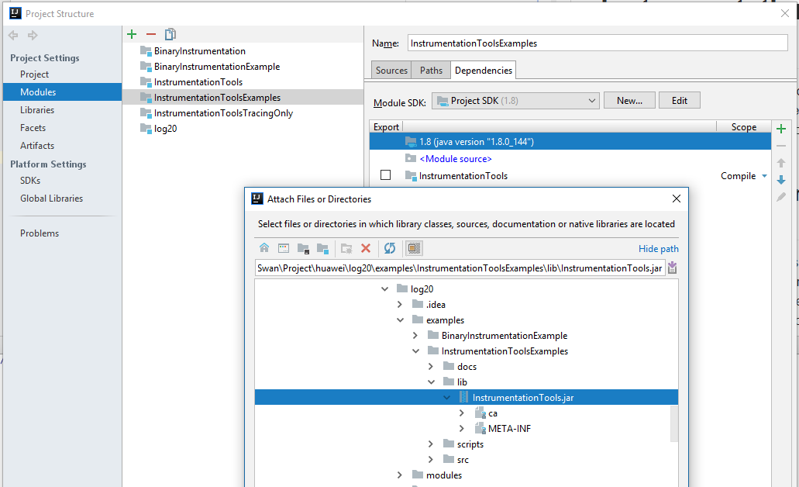

# Instrumentation Tools Examples
This example primarily shows how to manually use the instrumentation library 
by modifying the source code.
In practice, we always use the binary instrumentation module to automatically 
configure the trace points without having access to the source code.

## How to Configure the Example in intellij IDE? 
1. Select **File | Project Structure** to open the **Project Structure** dialog.
2. Under **Project Settings**, select **Modules**. 
3. Select **Dependencies** tab.
4. On the right hand side, click the **+** and select **Jar or Directories...** option.
5. Select the appropriate instrumentation library JAR and click okay.    
This step is equivalent of putting the the JAR on the example's classpath.    

## How to Manually Run the Example
1. Compile the example using javac
2. Run SimpleExample1 and include the lib/InstrumentationTools.jar in the classpath.
