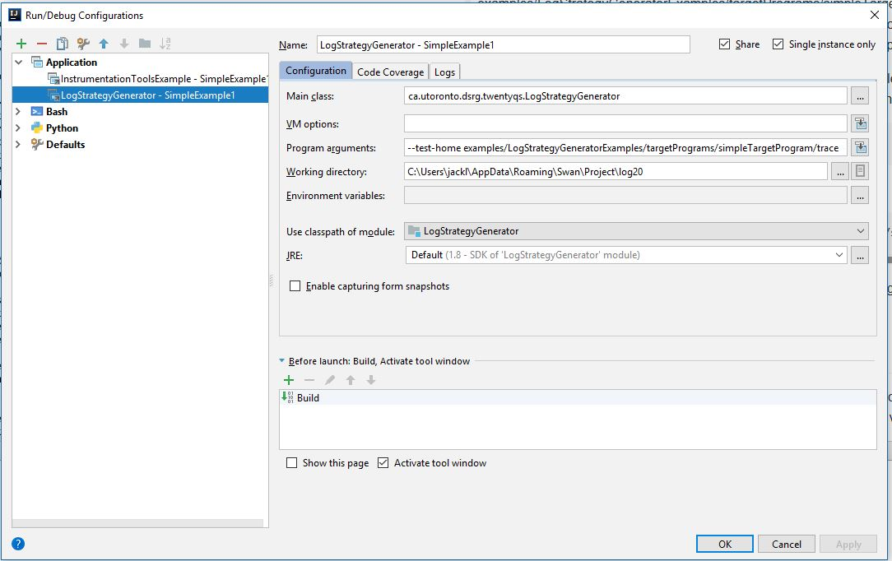

# Log Strategy Generator Examples
The log strategy generator show cases a simple analysis example using simpleTargetProgram
as well as using Hadoop. 
We have already collected some sample traces for you and organized them accordingly.

## Technical Jargon
There are some technical jargons / words which is used in this module. 

### Threshold
Threshold is a number which represents "performance" threshold. 
We first calculate all the request path found in the trace files. 
Then, we assign weights to each path based on the probability of appearance. 
Say the threshold is 0.1, it represents overhead of 0.1 log message 
being printed in each weight adjusted paths.

## How to Read The Output Result?
The output result will be printed in stdout and looks similar to the content below:
```
1. BB Cnt:1402
2. Total number paths: 2350
3. Number of paths containing 68 : 1568
4. number of paths:1668
5. number of paths in appearance:250
...
6. Threshold: 0.23
...
7. Final choice: [0, 41, 42, 58, 59, 67, 68, 77, 195, 212, 213, 214], with entrophy: 3.5263771537415627, total enrtopy: 6.411936434219753, path avg length: 0.23063829787233966, total avg length: 333032.41021276615
8+ 372-0, Weight: 1, Entropy: 6.3978233410448375
   13604-0, Weight: 1, Entropy: 6.382650714942164
   25335-0, Weight: 1, Entropy: 6.406557356312353
   2533-10, Weight: 3, Entropy: 6.356215357753824
   28910-6, Weight: 3, Entropy: 6.242713560351788
   2798-13, Weight: 10, Entropy: 6.183472376294963
   2770-62, Weight: 13, Entropy: 6.193568003042965
   13665-3, Weight: 27, Entropy: 6.212237261133895
   2533-15, Weight: 83, Entropy: 5.80262883260124
   24627-3, Weight: 119, Entropy: 5.989106056864638
   2752-1, Weight: 136, Entropy: 5.7469826945497875
   24627-1, Weight: 143, Entropy: 5.683251856288632
...
```
1: number of basic blocks in the traced method   
2-5: basic analysis of the request paths
6: threshold value (0 - infinity)
7: some debug information on which available log strategy to use
8+: location of method id and basic block id to insert a log message

Note: \<xxxx\>-\<yy\> can be decoded using a simple python script in this location.
examples/LogStrategyGeneratorExamples/scripts/decodeMethodAndBasicBlock.py
The python script requires 3 inputs: 
1. \<xxxx\>-\<yy\>
2. path of MethodSignatureMapping.log
3. BBProperties.log files.
\<xxxx\> is the= used to lookup the entries MethodSignatureMapping.log and 
\<yy\> is used to lookup the entries in BBProperties.log.


# SimpleTargetProgram Example
There were two steps which which generated. 

In the first step, Transformed JARs, BBProperties.log and MethodSignature.log were generated using the Binary Instrumentation. 
We only need the BBProperties.log and MethodSignatureMapping.log as input files. 
These two files are copied into examples/LogStrategyGeneratorExamples/targetPrograms/simpleTargetProgram/trace
for your convenience.

The second step is running a representative workload (ideally production workload) 
using the transformed JARs from the last step to collect trace.
In this case, we simply executed the main class.
A trace file (*.stats file) is produced as the output of the second step.
The trace file is copied to 
examples/LogStrategyGeneratorExamples/targetPrograms/simpleTargetProgram/trace/statsFiles 
for your convenience.
Then we picked one of the trace file (in this case there's only 1), rename it to trace.txt,
then put it in the same folder of BBProperties.log and MethodSignatureMapping.log file.

After the two steps above, we have all 3 files needed to run the example.

## Run using Idea Intellij
We need to include `commons-codec-1.10.jar`, `LoggableVarFinder.jar`, `soot-trunk.jar` in 
`modules/LogStrategyGenerator/lib` to the library classpath. 
Then simply invoke ca.utoronto.dsrg.twentyqs.LogStrategyGenerator class with
the following input: 
```
--test-home <path to the 3 files> --threshold <value>
```
For example, I've used the following: 
```
--test-home examples/LogStrategyGeneratorExamples/targetPrograms/simpleTargetProgram/trace  --threshold 0.1
```



The stdout are copied to a file manually and stored in simpleTargetProgram/results folder.

## Run example using command line
1. Run `cd ../../modules/LogStrategyGenerator && ./run-log20.sh`
The script contains information on how to compile and run the program. 
It is almost the equivalent version of running inside Idea Intellij IDE. 

# Hadoop Example
Hadoop example is largely configured the same as the simpleTargetProgram example. 
However, in this case, we have pre-calculated the log strategies with multiple threshold values. 
